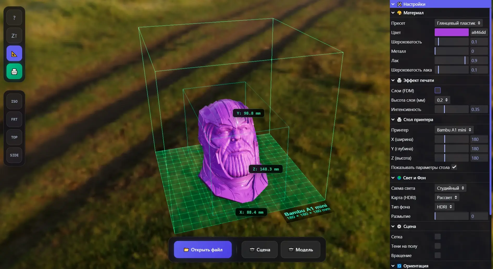

# STL/3MF 照片亭



**[stl.guilliman.ru](https://stl.guilliman.ru)**

用于3D打印的在线3D模型查看器。支持STL和3MF文件。

## 功能

- 🎨 **材质** — 19种预设（PLA、金属、玻璃、陶瓷等）
- 🖨️ **打印平台** — 50+种打印机模型，大小检查
- 🌍 **照明** — 8种照明方案，8种HDRI贴图
- 📐 **尺寸** — 以毫米为单位的精确模型尺寸
- 📷 **截图** — 导出场景或带透明背景的模型
- 🌐 **语言** — EN, RU, ES, 中文, 日本語
- 💾 **持久化** — 设置保存在浏览器中

## 操作控件

**鼠标：**
- 左键 — 旋转
- 右键 — 平移
- 滚轮 — 缩放

**键盘：**
- `1` — 等轴视图
- `2` — 正面视图
- `3` — 顶部视图
- `4` — 侧面视图

## 技术栈

- Three.js
- WebGL 2.0
- ES6 Modules

## 本地开发

```bash
npm install
npm run dev